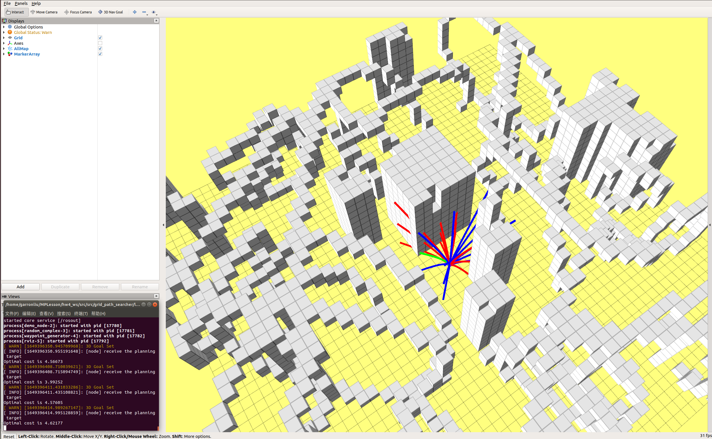
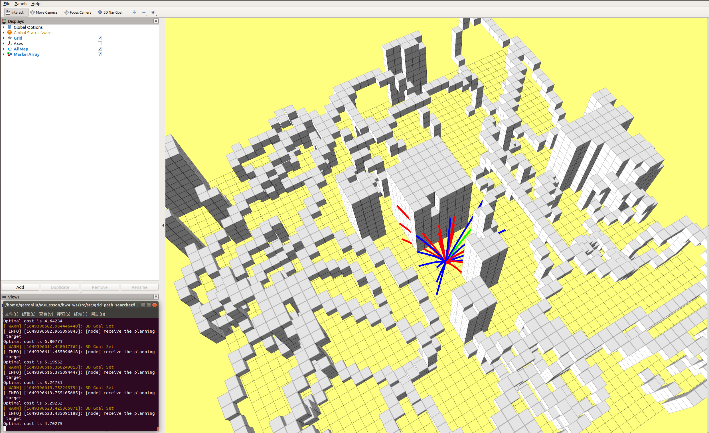
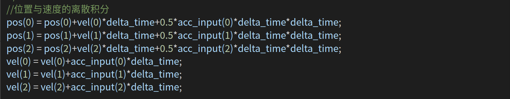
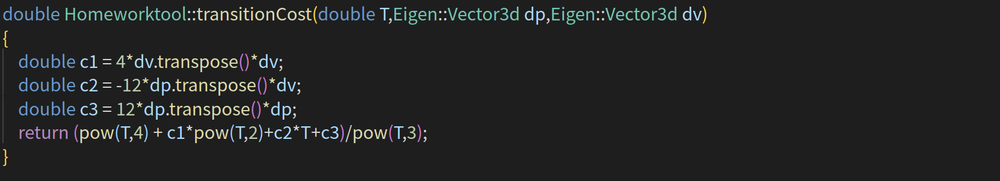
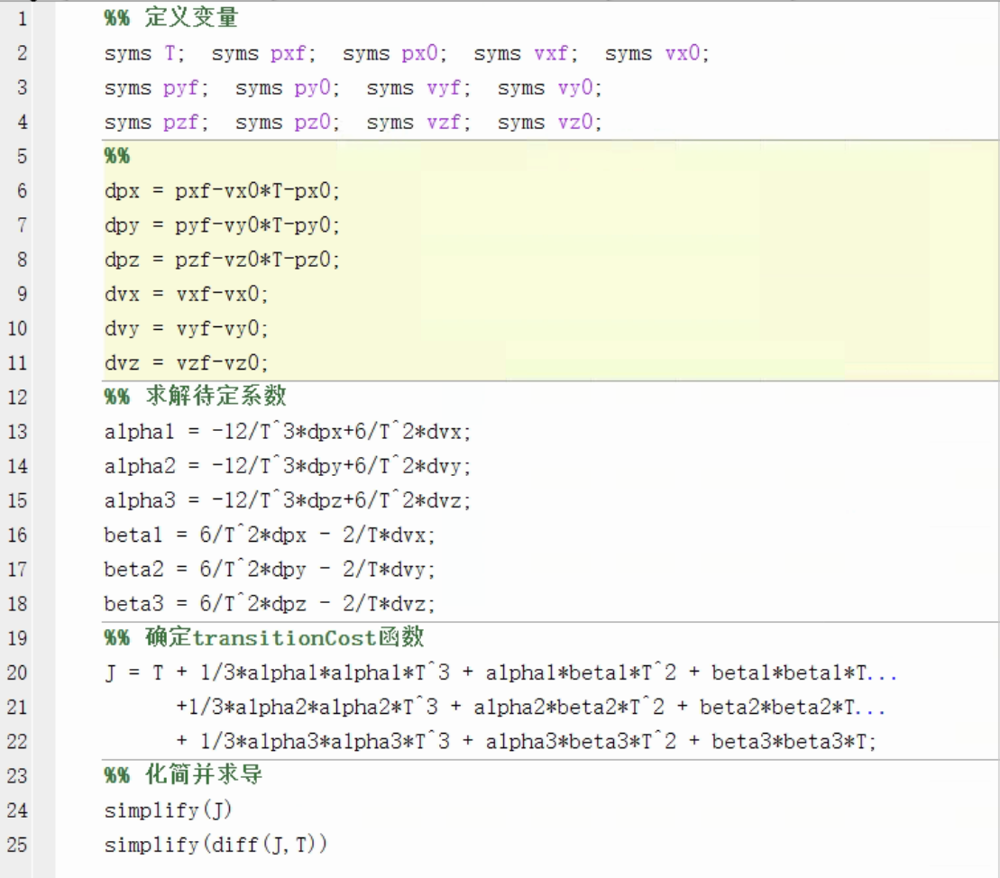

# Motion_Planning_Hw4

深蓝学院《移动机器人运动规划》第九期，第4周课程作业。该代码实现了在给定初速度下生成采样轨迹集合，并基于OBVP确定轨迹末端到目标点的最优代价及时间消耗。
---

# Compile

使用以下指令下载和编译代码：
    
```
mkdir -p ~/MPLesson_ws/src
cd ~/MPLesson_ws/src
git clone https://github.com/GarronLiu/Motion_Planning_Hw4.git
cd ..
catkin_make
```

# Run the Package

```
cd ~/MPLesson_ws 
source devel/setup.bash
roslaunch grid_path_searcher demo.launch 
```
选取起点和目标点即可开始规划。

# Result

在栅格地图中设置3D Nav Goal即可看到如下结果：

<p align='center'>
    
    
</p>

红色轨迹受障碍物阻挡，蓝色为可行轨迹，绿色表示末端到目标点代价最小（基于OBVP求解）的轨迹

# Main code change

## 重新选择父节点代码

<p align='center'>
    
</p>

## 重布线随机树过程

<p align='center'>
    
</p>

## 三维椭圆体内均匀采样

<p align='center'>
    
</p>

单位球体内均匀采样公式：

<p align='center'>
    
</p>
ξ_i 服从单位均匀分布。

